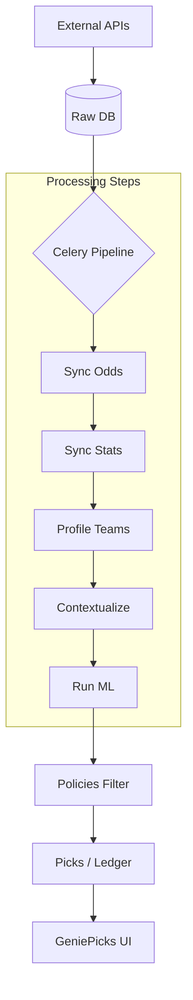

# ⚡ GENIEPICKS: END-TO-END SYSTEM WORKFLOW

> **"System real score predict karta hai → market se compare karta hai → jahan difference hota hai wahi pick ban jaata hai"**

---

## 🧩 1. COMPLETE REAL FLOW (The Lifecycle)
1.  **Match Data Ingestion:** Live odds aur schedules fetch hote hain.
2.  **Player Stats Ingestion:** Box scores aur pichle performance records process hote hain.
3.  **Team Analysis:** Pace, offensive rating, aur defensive profiles calculate hote hain.
4.  **Model Prediction:** ML engine har player ke liye ek "Projected Score" generate karta hai.
5.  **Vegas Comparison:** Humare prediction ko Sportsbook (Market) ki line se compare kiya jata hai.
6.  **Edge Calculation:** Dono ke beech ka difference (Edge %) nikalta hai.
7.  **Policy Filter:** Edge strength aur confidence levels ke basis par filtering hoti hai.
8.  **Pick Generation:** Sirf best-value picks UI par display hote hain.
9.  **Match Completion:** Result aane par Ledger auto-update hota hai (Win/Loss).

---

## 🧭 2. MENU-WISE MODULES & DATA FLOW

### 1. ⚡ SLATE (Game Overview)
*   **Purpose:** Aaj ke sab matches aur unka matchup-level summary dikhana.
*   **Data Points:** Teams, Spread, Vegas O/U, Model O/U, Pace, Injury Impact, Blowout Risk.
*   **Flow:** Game Data → Team Stats → Calculate Pace/Score → Render UI.

### 2. 🔥 TOP PICKS (The Profit Center 🔑)
*   **Purpose:** Har player ke best-value bets show karna.
*   **Data Points:** Player Name, Market Line, Model Prediction, Edge %, Confidence.
*   **Flow:** Stats Feed → ML Prediction → Market Comparison → Edge Detection → Policy Filter → Show.

### 3. 📊 LINEUP (User Strategy Tool)
*   **Purpose:** User ke apne picks ko analyze aur optimize karna.
*   **Data Points:** User Input (Picks), Hit Probabilities, EV (Expected Value).
*   **Flow:** Input Picks → Fetch Model Predictions → Joint Probability Calculation → Risk/Reward Output.

### 4. 📈 PERFORMANCE (Accuracy Audit)
*   **Purpose:** Model ki reliability aur profit transparency dikhana.
*   **Data Points:** Wins/Losses, Hit Rate %, Net Profit.
*   **Flow:** Results Sync → Pick Comparison → Historical Calculation → Performance Banding.

### 5. 📚 LEDGER (Transaction History)
*   **Purpose:** Har ek generate hue pick ka immutable record rakhna.
*   **Data Points:** Player, Market, Pick Side, Result (W/L), Profit/Loss.
*   **Flow:** Pick Generation → Initial Save → Game End → Final Result Update.

### 6. ⚙️ ENGINE (AI Summary)
*   **Purpose:** Model ke overall health aur top conviction points ka overview.
*   **Data Points:** Aggregate Confidence %, Snapshot Metrics, Top Predictions.
*   **Flow:** ML Model Output → Data Aggregation → Summary Visualization.

### 7. 🔁 SERIES (Monte Carlo Simulation)
*   **Purpose:** Long-term series ya playoff outcomes ko simulate karna.
*   **Flow:** Team Profiles → Run 1,000+ Monte Carlo Simulations → Probabilistic Winner Prediction.

### 8. 📜 POLICIES (Gatekeeper System)
*   **Purpose:** Decide karna ki kaunsa pick "Show" hoga aur kaunsa "Hide".
*   **Logic Example:** `if (edge > 3% && confidence == 'High') { Display Pick } else { Suppress }`

### 🔄 9. PIPELINE (The Nervous System 🔥)
Poora backend yahan se control hota hai:
1.  **Odds Ingest:** Vegas lines capture karna.
2.  **Stats Ingest:** Player box scores save karna.
3.  **Team Profiling:** Pace aur defense dynamics calculate karna.
4.  **Game Context:** Expected score aur matchup risk analyze karna.
5.  **Model Execution:** Final ML predictions generate karna.

---

## 🛠️ 3. TECHNICAL ARCHITECTURE

---
*Version: 1.1.0*  
*Status: 100% Architecturally Aligned*
